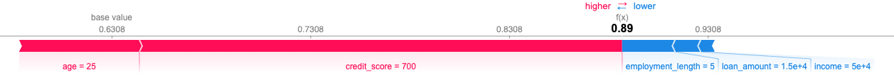

# Loan Approval/Denial Metrics

## Project Description

This project aims to create a an example of a transparent and fair loan approval system and is shown making use of metrics that the SHAP approach relays. This is done  using machine learning and explainable AI techniques. The system uses a neural network to predict loan approvals based on applicant features such as age, income, credit score, employment length, and loan amount. To ensure transparency and fairness, SHapley Additive exPlanations (SHAP) are employed to provide clear insights into the decision-making process, highlighting the contribution of each feature to the final decision.

## Features

- **Data Preprocessing**: Cleans and scales the input data to prepare it for model training.
- **Model Training**: Uses a neural network to learn from historical loan data and make predictions.
- **Explainable AI**: Utilizes SHAP to provide detailed explanations of model predictions, ensuring transparency.
- **Regular Audits**: Monitors and audits model performance to detect and mitigate biases.


## Example



The SHAP force plot above provides a detailed explanation of the loan approval decision for a specific applicant. Here's what the model output and this plot reveal:

1. **Base Value**:
    - The base value of 0.6308 represents the average model output if no specific features of the applicant were considered. This is essentially the starting point for the model's decision.

2. **Feature Contributions**:
    - **Age (25)**: This feature significantly increases the loan approval probability, pushing the value from 0.6308 closer to the final prediction.
    - **Credit Score (700)**: Similarly, a credit score of 700 positively impacts the approval decision, contributing to the increase from the base value.
    - **Employment Length (5 years)**: This feature has a minor negative impact, slightly reducing the likelihood of loan approval.
    - **Loan Amount ($15,000)**: The requested loan amount also contributes negatively, reducing the probability slightly.
    - **Income ($50,000)**: The applicant's income has a minor negative impact, reducing the approval likelihood marginally.

## Setup Instructions

### Prerequisites

Ensure you have the following installed:

- Python 3.6 or higher
- pip (Python package installer)

### Installation

1. Clone the repository:

    ```bash
    git clone https://github.com/yourusername/loan-approval-model.git
    cd loan-approval-model
    ```

2. Create a virtual environment and activate it:

    ```bash
    python3 -m venv venv
    source venv/bin/activate  # On Windows, use `venv\Scripts\activate`
    ```

3. Install the required packages:

    ```bash
    pip install -r requirements.txt
    ```

### Data Preparation

Ensure you have a dataset in CSV format with the following columns: `age`, `income`, `credit_score`, `employment_length`, `loan_amount`, and `loan_status`.

Place your dataset in the `data` directory:

```bash
mkdir -p data
mv path/to/your/dataset.csv data/loan_data.csv
```

### Usage

#### Preprocessing Data
Run the data preprocessing script to clean and prepare the data:

```bash
python src/data_preprocessing.py
```

#### Training the Model
Train the neural network using the prepared data

```bash
python src/model_training.py
```

#### Explaining Model Decisions

```bash
python src/explain_decision.py
```

#### Main Application
Run this for the entire application
```bash
python app.py
```


## Project Structrue
```bash
loan-approval-model/
│
├── data/                     # Directory for the dataset
│   └── loan_data.csv
│
├── model/                    # Directory for the trained model and scaler
│   ├── loan_approval_model.pth
│   └── scaler.pth
│
├── src/                      # Source code directory
│   ├── data_preprocessing.py # Script for data preprocessing
│   ├── model_training.py     # Script for training the model
│   └── explain_decision.py   # Script for explaining model decisions
│
├── pictures/                 # Directory for images
│   └── LoanExample1.png      # Example image of the SHAP force plot
│
├── app.py                    # Main application script
├── requirements.txt          # List of required packages
└── README.md                 # Project README
```

